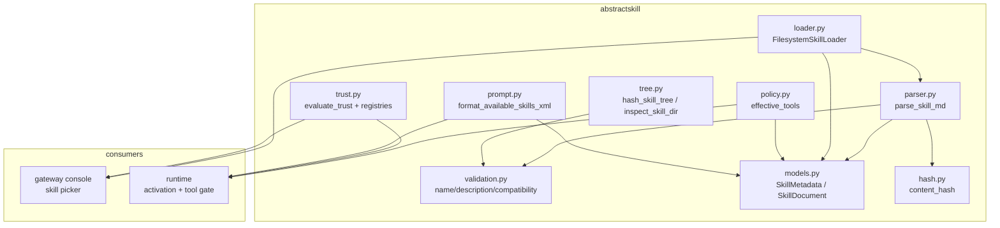
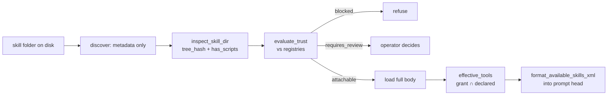
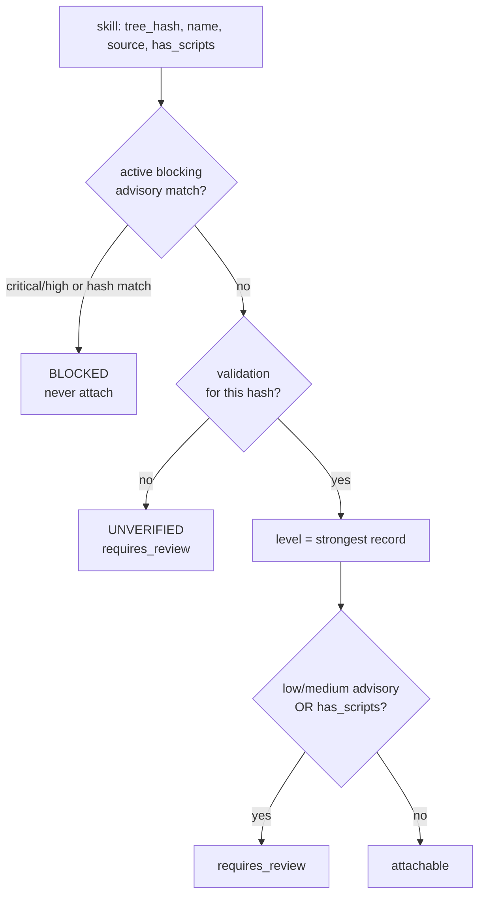

# Architecture

AbstractSkill is a passive contract library: it parses, validates, hashes,
discovers, composes, and classifies skills. It executes nothing and imposes no
runtime limits — hosts (the gateway console, the runtime activation path)
consume its contracts and enforce policy.

## Components

## Data flow: skill selection through trust and composition

## Trust verdict precedence

## Key design decisions

- **Hash = bytes, parse = meaning.** `content_hash` (one document) and
  `hash_skill_tree` (whole folder, length-prefixed injective manifest) are
  byte-exact. Trust binds to the tree hash; any byte change voids a validation
  and a post-approval tamper is detected. See [trust model](trust.md).
- **Progressive disclosure.** `discover()` reads only frontmatter;
  `load()`/`read_skill_resource` fetch bodies and resources on demand with
  size bounds.
- **Grant is the only tool authority.** `effective_tools` narrows below the
  operator grant, never widens; absence of `allowed-tools` implies nothing.
- **Fail closed.** Unknown, script-bearing, or low/medium-advisory skills
  require review; only a validated, clean skill is `attachable`.
- **Passive by design.** No execution, no scheduling, no runtime caps —
  keeping the framework's agency in the hosts, not the contract library.

## Registries (data, not code)

- `registry/skills/<name>/` — the vendored first-party shelf (byte-verbatim).
- `registry/validations.yaml` — trust attestations bound to tree hashes
  (regenerated by `scripts/refresh_shelf.py`).
- `registry/advisories.yaml` — specific do-not-use skills (four mandated
  fields; empty at v1 until an audit or feed names a real one).
- `registry/guidance.yaml` — category-level risk notices (never block a
  specific skill).
