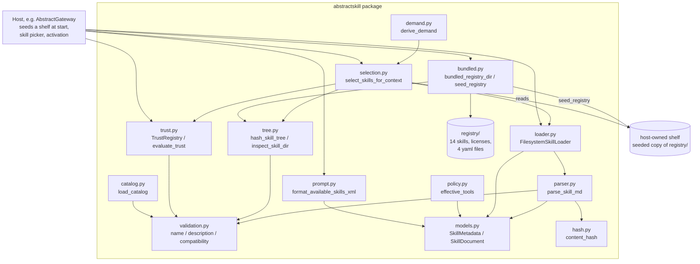
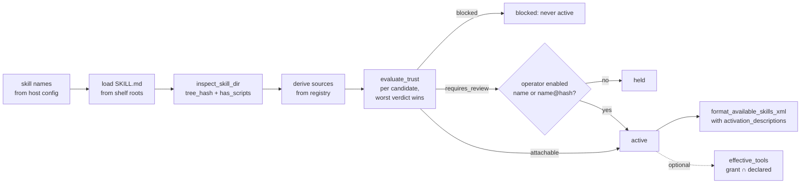
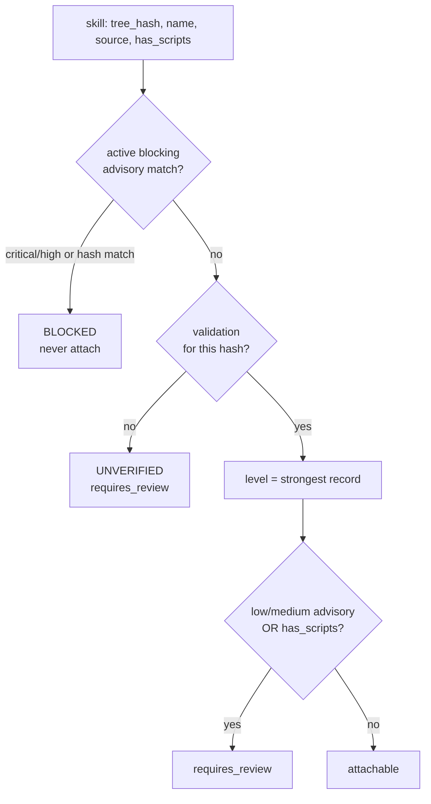
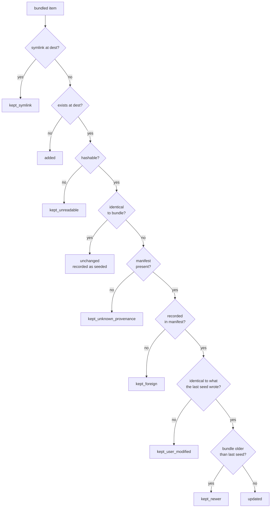

# Architecture

AbstractSkill is a passive contract library: it parses, validates, hashes,
discovers, composes, and classifies skills. It executes nothing and imposes no
runtime limits — hosts such as AbstractGateway consume its contracts and
enforce policy. It uses no network. See the [API reference](api.md) for the
public surface and the [trust model](trust.md) for verdict semantics.

## Components

Arrows point from a module to the modules it uses. Hosts such as
AbstractGateway call the public API; they never reach into the package
directory itself.

```mermaid
graph TD
    subgraph pkg[abstractskill package]
        parser[parser.py<br/>parse_skill_md]
        validation[validation.py<br/>name / description / compatibility]
        models[models.py<br/>SkillMetadata / SkillDocument]
        hash[hash.py<br/>content_hash]
        loader[loader.py<br/>FilesystemSkillLoader]
        tree[tree.py<br/>hash_skill_tree / inspect_skill_dir]
        trust[trust.py<br/>TrustRegistry / evaluate_trust]
        selection[selection.py<br/>select_skills_for_context]
        prompt[prompt.py<br/>format_available_skills_xml]
        policy[policy.py<br/>effective_tools]
        demand[demand.py<br/>derive_demand]
        catalog[catalog.py<br/>load_catalog]
        bundled[bundled.py<br/>bundled_registry_dir / seed_registry]
        registry[(registry/<br/>14 skills, licenses,<br/>4 yaml files)]
    end

    parser --> validation
    parser --> models
    parser --> hash
    loader --> parser
    loader --> models
    tree --> validation
    trust --> validation
    catalog --> validation
    selection --> loader
    selection --> tree
    selection --> trust
    demand --> selection
    policy --> models
    prompt --> models
    bundled --> tree
    bundled --> registry

    host[Host, e.g. AbstractGateway<br/>seeds a shelf at start,<br/>skill picker, activation]
    shelf[(host-owned shelf<br/>seeded copy of registry/)]

    host --> bundled
    bundled -->|seed_registry| shelf
    host --> selection
    selection -->|reads| shelf
    host --> prompt
    host --> loader
    host --> trust
```

## Data flow: activating skills through the trust gate

`select_skills_for_context` runs the whole pipeline in one call, so the order
cannot be skipped. The host then renders the active skills into the prompt.

```mermaid
flowchart LR
    A[skill names<br/>from host config] --> B[load SKILL.md<br/>from shelf roots]
    B --> C[inspect_skill_dir<br/>tree_hash + has_scripts]
    C --> D[derive sources<br/>from registry]
    D --> E[evaluate_trust<br/>per candidate,<br/>worst verdict wins]
    E -->|blocked| F[blocked: never active]
    E -->|requires_review| G{operator enabled<br/>name or name@hash?}
    G -->|no| H[held]
    G -->|yes| I[active]
    E -->|attachable| I
    I --> J[format_available_skills_xml<br/>with activation_descriptions]
    I -.optional.-> K[effective_tools<br/>grant ∩ declared]
```

## Trust verdict precedence

```mermaid
flowchart TD
    S[skill: tree_hash, name, source, has_scripts] --> ADV{active blocking<br/>advisory match?}
    ADV -->|critical/high or hash match| BLOCK[BLOCKED<br/>never attach]
    ADV -->|no| VAL{validation<br/>for this hash?}
    VAL -->|no| UNV[UNVERIFIED<br/>requires_review]
    VAL -->|yes| LVL[level = strongest record]
    LVL --> REV{low/medium advisory<br/>OR has_scripts?}
    REV -->|yes| RR[requires_review]
    REV -->|no| ATT[attachable]
```

## Key design decisions

- **Hash = bytes, parse = meaning.** `content_hash` (one document) and
  `hash_skill_tree` (whole folder, length-prefixed injective manifest) are
  byte-exact. Trust binds to the tree hash; any byte change voids a validation
  and a post-approval tamper is detected. See [trust model](trust.md).
- **Progressive disclosure.** `discover()` reads only frontmatter;
  `load()`/`read_skill_resource` fetch bodies and resources on demand with
  size bounds.
- **Grant is the only tool authority.** `effective_tools` narrows below the
  operator grant, never widens; absence of `allowed-tools` implies nothing.
- **Fail closed.** Unknown, script-bearing, or low/medium-advisory skills
  require review; only a validated, clean skill is `attachable`.
- **Passive by design.** No execution, no scheduling, no runtime caps —
  keeping the framework's agency in the hosts, not the contract library.

## Registries (data, not code)

The registry ships in the wheel as package data (`abstractskill/registry/`).
`abstractskill.bundled` locates it and seeds host-owned copies;
`catalog.yaml` carries the bundle `version` (dotted numbers, for example
`2026.09.25`), which increases whenever bundled content changes.

### Seeding a host shelf

`seed_registry(dest)` decides per item (each skill folder by tree hash, each
file by sha256), holding an exclusive lock on `<dest>/.seed.lock` for the
whole call. `<dest>/.seeded.json` records the hash of every item a seed
wrote and the bundle version.

```mermaid
flowchart TD
    S[bundled item] --> SYM{symlink at dest?}
    SYM -->|yes| KS[kept_symlink]
    SYM -->|no| EX{exists at dest?}
    EX -->|no| ADD[added]
    EX -->|yes| RD{hashable?}
    RD -->|no| KU[kept_unreadable]
    RD -->|yes| SAME{identical<br/>to bundle?}
    SAME -->|yes| UN[unchanged<br/>recorded as seeded]
    SAME -->|no| MAN{manifest<br/>present?}
    MAN -->|no| KP[kept_unknown_provenance]
    MAN -->|yes| REC{recorded<br/>in manifest?}
    REC -->|no| KF[kept_foreign]
    REC -->|yes| PRIS{identical to what<br/>the last seed wrote?}
    PRIS -->|no| KM[kept_user_modified]
    PRIS -->|yes| OLD{bundle older<br/>than last seed?}
    OLD -->|yes| KN[kept_newer]
    OLD -->|no| UPD[updated]
```

Items are written through a staging folder and renamed into place; if a
folder swap fails, the previous copy is restored. Items a previous seed
wrote that the bundle no longer contains are reported as `not_in_bundle`
and never deleted. A second seed with the same bundle writes nothing. The
manifest is rewritten only when it changes.

AbstractGateway seeds `<data dir>/skills/registry` when it starts and serves
that copy unless the operator sets its `skills.shelf` setting to another
folder.

### Registry files

- `src/abstractskill/registry/skills/<name>/` — the vendored curated shelf (byte-verbatim; first-party + catalog-vendored).
- `src/abstractskill/registry/catalog.yaml` — the curated vendoring catalog: reviewed entries
  pinned to upstream commits + whole-tree hashes; the ONLY admissible source
  list for `scripts/vendor_skill.py` (validated by `abstractskill.catalog`).
- `src/abstractskill/registry/validations.yaml` — trust attestations bound to tree hashes
  (regenerated by `scripts/refresh_shelf.py`; catalog-vendored skills derive
  their policy from the catalog entry).
- `src/abstractskill/registry/advisories.yaml` — specific do-not-use skills (four mandated
  fields; empty at v1 until an audit or feed names a real one).
- `src/abstractskill/registry/licenses/` — upstream licenses of vendored
  third-party skills, kept outside the skill trees so the tree hash covers
  only upstream bytes.
- `src/abstractskill/registry/guidance.yaml` — category-level risk notices (never block a
  specific skill).

For the design history and planned trust work, see the
[backlog overview](backlog/overview.md).
